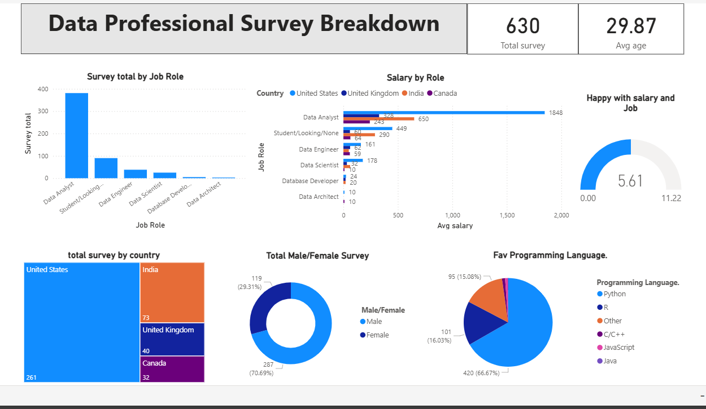

# Data Professional Survey Breakdown

A Power BI dashboard that visualizes the results of a survey conducted among data professionals worldwide. This project provides insights into salary distributions, gender representation, popular programming languages, and geographic trends within the data field.

## PowerBI Link 
[Link](https://app.powerbi.com/groups/me/reports/b3d748a8-440d-4c18-aa8c-90ba99c54b26/00a7b35c260001564390?experience=power-bi)

## 📊 Project Overview

This interactive dashboard was built to analyze and present key findings from a survey of data professionals, including Data Scientists, Data Engineers, Data Analysts, and others. The goal is to uncover trends related to compensation, demographics, tools, and job satisfaction, providing valuable insights for both aspiring and current data professionals.

## 🎯 Key Insights & Features

The dashboard is organized into several key sections:

*   **Survey Overview:** Total number of respondents and breakdown by primary job role.
*   **Compensation Analysis:**
    *   **Average Salary by Role:** Compares average yearly compensation across different data professions.
    *   **Salary by Country:** Examines how salaries differ geographically (e.g., US, UK, Canada).
*   **Demographic Breakdown:**
    *   **Gender Distribution:** A visual representation of male/female participation in the survey and the field.
*   **Tool & Technology Popularity:** (Inferred) Charts showing the most commonly used programming languages (Python, R, SQL) and tools (Power BI, Tableau, Excel) among respondents.
*   **Interactive Filters:** Use slicers to dynamically filter the entire report by:
    *   Country
    *   Job Title
    *   Gender

## 🛠️ Data Sources & Transformation

*   **Data Source:** The dataset is based on a publicly available survey of data professionals (e.g., from Kaggle, a custom survey, or an online poll).
*   **ETL Process:** Data was loaded and transformed using Power Query in Power BI Desktop.
    *   Steps included: Cleaning column names, handling missing values, categorizing continuous variables like salary into ranges, and standardizing country names.

## 📈 Data Model

A simple and efficient single-table data model was used for this analysis.
<!-- For a survey analysis, a star schema is often overkill. A single flat table is common. -->

*   The model consists of one primary table containing all survey responses.
*   Calculated tables were likely created for dimensions like `Date` or `Salary ` to enable more nuanced analysis.
*   DAX measures were created to calculate averages salary

